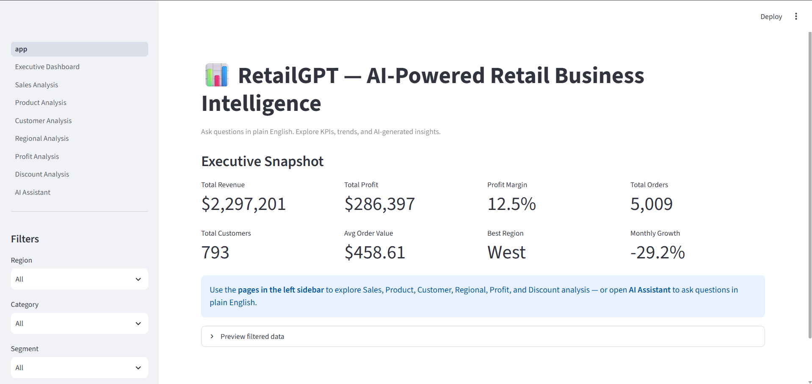
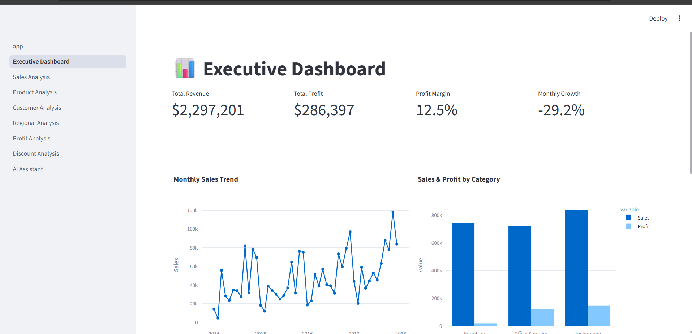
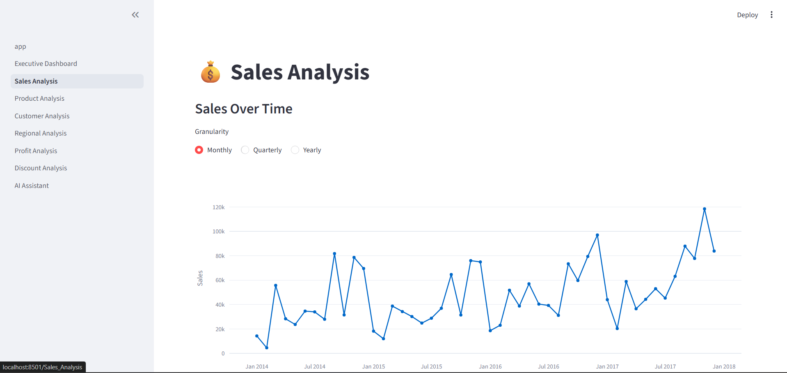
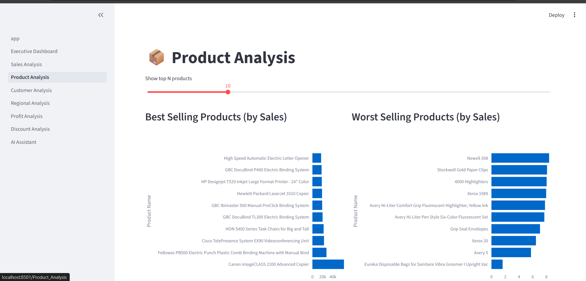
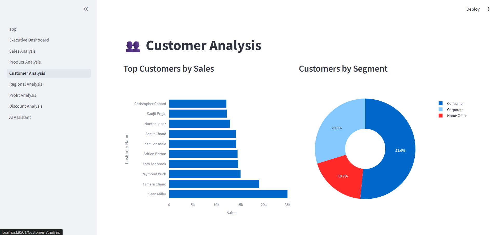
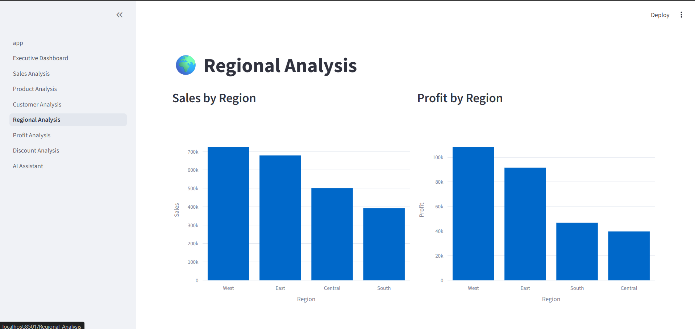
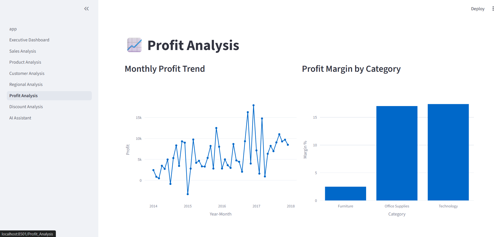
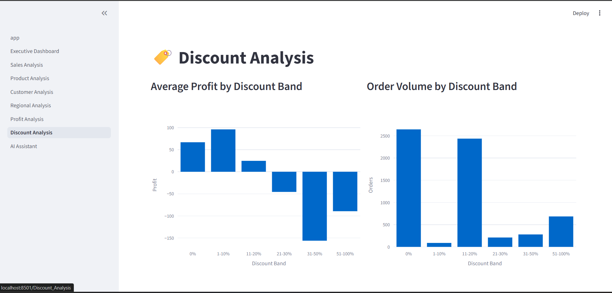
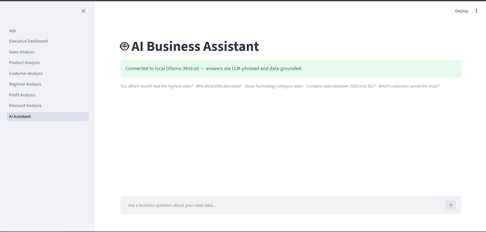

# 🛍️ RetailGPT — AI-Powered Business Intelligence & Sales Analytics Platform

> An AI-powered BI platform built on the classic **Superstore** dataset. Explore retail sales through an interactive Streamlit dashboard, or just ask questions in plain English and let a locally-hosted LLM (**Mistral** or **Llama 3.1 8B** via **Ollama**) answer them — grounded in real pandas calculations, not hallucinated numbers.


---

## 📖 Table of Contents

- [Overview](#-overview)
- [Dashboard Walkthrough](#-dashboard-walkthrough)
- [What's Actually Built & Tested](#-whats-actually-built-and-tested-here)
- [Project Structure](#-project-structure)
- [Setup & Installation](#-setup-run-this-locally--not-in-a-sandbox)
- [How the Chatbot Avoids Hallucinating Numbers](#-how-the-chatbot-avoids-hallucinating-numbers)
- [Dataset](#-dataset)
- [Suggested Next Steps](#-suggested-next-steps-not-built-yet)

---

## 🚀 Overview

**RetailGPT** turns raw retail transaction data into instant, actionable business insight — through a full 9-page interactive dashboard *and* a conversational AI assistant that understands your numbers.

At a glance, the platform tracks:

| Metric | Value |
|---|---|
| 💰 Total Sales | **$2.29M** |
| 📈 Total Profit | **$286K** |
| 📊 Profit Margin | **12.5%** |
| 📦 Total Orders | **5,000+** |
| 🧑‍🤝‍🧑 Total Customers | **793** |

The entire dashboard can be filtered live by **Region**, **Category**, and **Customer Segment** — every chart and KPI updates instantly.

---

## 🖥️ Dashboard Walkthrough

### 1️⃣ Landing Page
The welcome screen for **RetailGPT**. A left-hand navigation sidebar gives access to every page — Executive Dashboard, Sales Analysis, Product Analysis, Customer Analysis, Regional Analysis, Profit Analysis, Discount Analysis, and the AI Assistant. Top-line KPIs (sales, profit, margin, orders, customers) are visible at a glance, with global filters for Region, Category, and Customer Segment.
<p align="center">
  
</p>

### 2️⃣ Executive Dashboard
A manager's quick-glance summary of the whole business:
- 📅 Monthly sales trend, **2014–2018**
- 🏷️ Sales vs. profit by category — **Technology** leads
- 🌎 Sales by region (donut chart) — **West region** holds the largest share
- 👥 Profit by customer segment — **Consumer** segment is the most profitable
<p align="center">
  
</p>

### 3️⃣ Sales Analysis
A deep dive into sales performance:
- Toggle between **Monthly / Quarterly / Yearly** views
- Sales by shipping method — **Standard Class** dominates
- Sales by product sub-category — **Phones** and **Chairs** are best-sellers
- Year-over-year comparison tool to track performance changes
<p align="center">
  
</p>

### 4️⃣ Product Analysis
Understand which products actually drive the business:
- Adjustable display count for top products
- 🏆 Top-selling products — the **Canon imageCLASS Copier** leads
- 📉 Lowest-selling products
- 💵 Most profitable products — because top sales ≠ top profit
<p align="center">
  
</p>

### 5️⃣ Customer Analysis
Customer-level insight for retention and targeting:
- Highest-spending customers
- Customer segment breakdown — **Consumers** make up over half
- Segmentation into **VIP**, **Loyal**, and **At Risk** groups by purchase behavior
- 🔁 **98.5% repeat customer rate** — most customers come back
<p align="center">
  
</p>

### 6️⃣ Regional Analysis
Geographic performance at a glance:
- Sales & profit by region — **West** and **East** lead the pack
- Top states and cities — **California** and **New York City** top the list
- 🗺️ Interactive U.S. map colored by total sales, to spot strong vs. weak markets
<p align="center">
  
</p>

### 7️⃣ Profit Analysis
Where the money is actually made:
- Profit trend over time
- Profit margin by category — **Technology** and **Office Supplies** outperform **Furniture**
- Highest and lowest profit-margin products
- 📉 Discount vs. profit scatter chart — profit generally falls as discounts rise
<p align="center">
  
</p>

### 8️⃣ Discount Analysis
How discounting affects the bottom line:
- Average profit by discount level — heavier discounts can push products into a loss
- Order volume by discount range — most customers buy at little or no discount
- Category-level discount impact, to guide where discounts should be pulled back
<p align="center">
  
</p>

### 9️⃣ AI Assistant ⭐ *(favorite feature)*
The conversational core of RetailGPT — running **entirely locally** via **Ollama** and the **Mistral** model, with **no paid API required**.

Ask plain-English questions like:

> *"Which month had the highest sales?"*
<p align="center">
  
</p>

The assistant:
- ✅ Analyzes the real underlying sales data
- ✅ Gives a clear, grounded answer
- ✅ Offers business recommendations
- ✅ Automatically renders the relevant chart
- ✅ Points to the exact dashboard page for more detail

No more digging through pages — just ask.

---

## ✅ What's Actually Built and Tested Here

Everything below was written **and executed against the real dataset**
(`data/raw/Sample_-_Superstore.csv`, 9,994 rows, 2014–2017) inside the sandbox that generated this project:

| Component | Status |
|---|---|
| Data cleaning + feature engineering (`backend/services/data_service.py`) | ✅ Tested — runs, produces `data/processed/superstore_clean.csv` |
| Analytics agent (`agents/analytics_agent.py`) | ✅ Tested — real pandas answers (e.g. correctly found Nov 2017 as top sales month) |
| Recommendation agent (`agents/recommendation_agent.py`) | ✅ Tested — real, rule-based recommendations from actual data |
| Navigation agent (`agents/navigation_agent.py`) | ✅ Tested |
| Visualization agent (`agents/visualization_agent.py`) | ✅ Syntax-checked (Plotly figure builders) |
| Report agent (`agents/report_agent.py`) | ✅ Tested — generates a real PDF executive summary |
| FastAPI backend (`backend/api.py`) | ✅ Tested — `/health`, `/kpis`, `/chat` all verified with curl |
| Streamlit dashboard (8 pages) | ✅ Syntax-checked (Streamlit apps can't run headlessly, but every page compiles cleanly and reuses tested data/agent functions) |
| Notebooks (data cleaning, EDA, business analysis) | ✅ Executed top-to-bottom with no errors |
| **Ollama / Mistral chatbot connection** | ⚠️ Code is written and the fallback path is tested, but the live HTTP call to a running Ollama server has **not** been tested (no internet access in the sandbox to install Ollama or pull models). Verify this on your own machine — see setup below. The app works fine without it, using a templated fallback answer. |
| RAG / Documentation Agent (FAISS + Sentence Transformers) | ❌ Not built yet — see [next steps](#-suggested-next-steps-not-built-yet) |

*This is stated plainly so you know exactly what to trust, and what to verify yourself once running locally.*

---

## 📁 Project Structure

```
RetailGPT/
├── data/
│   ├── raw/Sample_-_Superstore.csv       # your uploaded dataset
│   └── processed/                        # generated by data_service.py
├── notebooks/                            # 01 cleaning, 02 EDA, 03 business analysis
├── dashboard/
│   ├── app.py                            # Streamlit entry point + global filters
│   └── pages/                            # 8 dashboard pages incl. AI Assistant
├── backend/
│   ├── api.py                            # FastAPI: /health /kpis /chat /report
│   └── services/
│       ├── data_service.py               # cleaning + KPI calculations
│       └── ollama_service.py             # Mistral/Ollama chatbot integration
├── agents/                               # analytics, visualization, navigation,
│                                          # recommendation, report agents
├── rag/                                  # scaffolding for future RAG docs agent
├── reports/                              # generated PDF reports land here
├── requirements.txt
├── .env.example
└── README.md
```

---

## ⚙️ Setup (run this locally — not in a sandbox)

### 1. Install Python dependencies
```bash
python -m venv venv
source venv/bin/activate        # Windows: venv\Scripts\activate
pip install -r requirements.txt
```

### 2. Install Ollama + pull a model
```bash
# https://ollama.com/download
ollama pull mistral
# or, if you'd rather use Llama 3.1 8B:
ollama pull llama3.1:8b
ollama serve            # usually starts automatically after install
```

### 3. Configure environment
```bash
cp .env.example .env
# edit .env if you're using llama3.1:8b instead of mistral:
# OLLAMA_MODEL=llama3.1:8b
```

### 4. Build the processed dataset (optional — built automatically on first run)
```bash
python backend/services/data_service.py
```

### 5. Run the dashboard
```bash
streamlit run dashboard/app.py
```
Open the **AI Assistant** page in the sidebar and ask a question. If Ollama is running, you'll see a green *"Connected to local Ollama"* banner and get LLM-phrased answers. If not, you'll still get correct answers via the templated fallback.

### 6. (Optional) Run the API separately
```bash
uvicorn backend.api:app --reload --port 8000
```
Then: `curl http://localhost:8000/kpis` or POST to `/chat`.

---

## 🧠 How the Chatbot Avoids Hallucinating Numbers

`agents/analytics_agent.py` computes the real answer from pandas **first** (e.g. highest sales month, profit-decline drivers, top customers). Only then does `backend/services/ollama_service.py` hand that already-computed JSON to Mistral and ask it to phrase it in natural language — the model is **never** asked to recall or estimate a number itself. If Ollama isn't running, a plain-English template fills in instead, so the app degrades gracefully rather than breaking.

---

## 📊 Dataset

Superstore sales dataset (`Sample_-_Superstore.csv`) — **9,994 orders, 2014–2017**, 21 raw columns (Order/Ship dates, Region, Category, Sub-Category, Sales, Profit, Discount, Quantity, Customer info, etc.), cleaned into **29 columns** with engineered business features:

- Year, Month, Quarter
- Profit Margin
- Order Processing Days
- Outlier flags

---

## 🔮 Suggested Next Steps (not built yet)

1. **RAG Documentation Agent** — embed this README + a data dictionary with Sentence Transformers into a FAISS index (`rag/vectorstore/`) so the chatbot can answer "what is Profit Margin?" style questions. Scaffolding folders are in place.
2. **LangGraph orchestration** — right now `ollama_service.answer_question()` is a simple linear pipeline (route → compute → phrase). Wrapping it as a LangGraph graph would allow branching (e.g., escalate to the Recommendation Agent automatically when profit decline is detected).
3. **`st.switch_page` navigation** — `navigation_agent.py` already returns the right page; wiring it to `st.switch_page()` would let the AI Assistant jump the user there directly instead of just naming it.
4. **PostgreSQL / SQLite** — swap `data_service.py`'s CSV read for a DB query if this grows past a single static file.

---

<p align="center">Built with ❤️ using Python, Streamlit, FastAPI, and Ollama.</p>